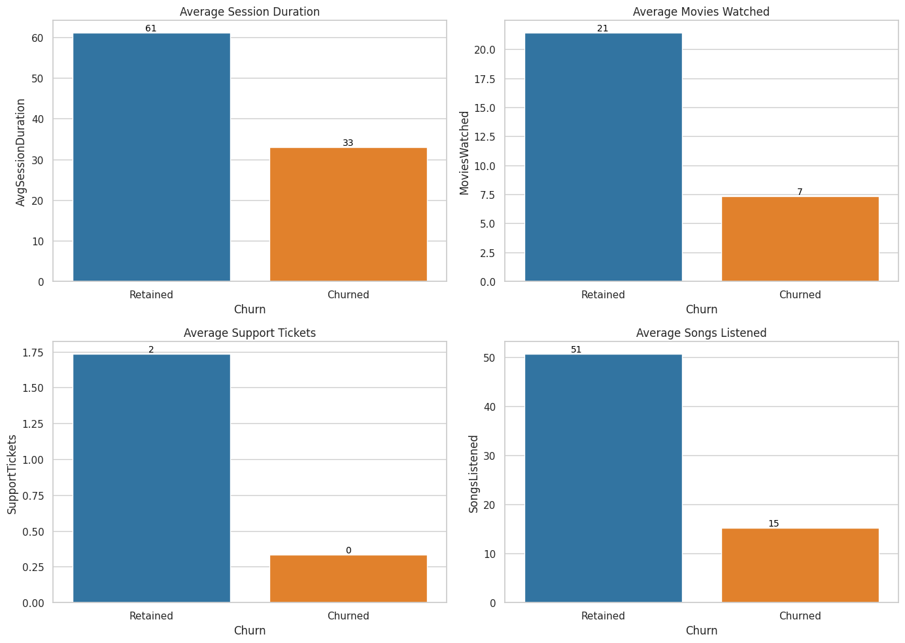
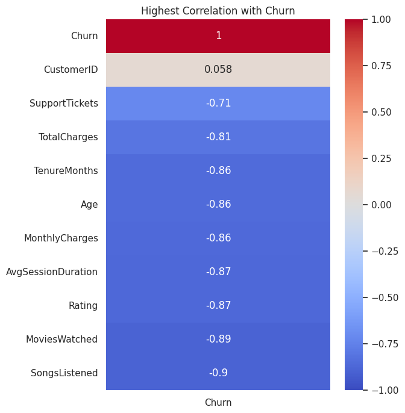
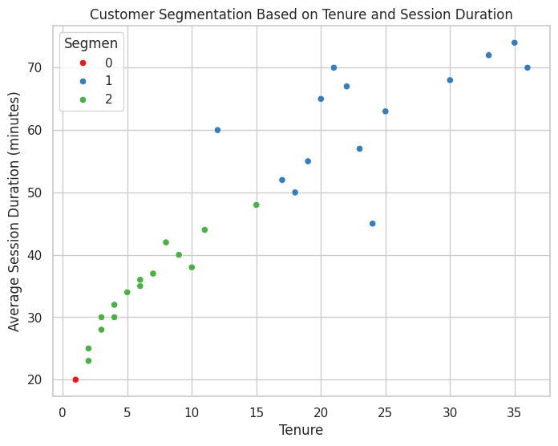
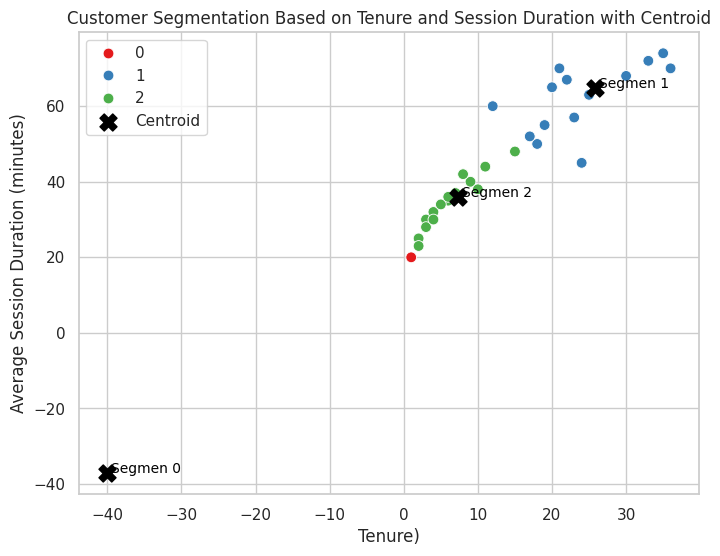

# **Test Case Data Scientist Documentation**

## **📘 Dataset Background**

This dataset contains customer data from a digital streaming service that offers both movie and music content. Each record represents an individual customer and includes demographic details (such as age, gender, and location), subscription information (plan type, payment method, and tenure in months), usage behavior (number of movies watched, songs listened, and average session duration), and customer support interaction (number of support tickets and service rating). The Churn column indicates whether a customer has discontinued the service (1) or remained subscribed (0), making this dataset highly suitable for churn prediction analysis and customer segmentation tasks.

[Dataset Source](https://docs.google.com/spreadsheets/d/1TTQBnuc2Wtg0dH7v3xUH6BAnocf1SU0QEJAZKQVZXHs/edit?gid=0#gid=0)

# **❓ Case Study Question**

## **1. What trends do you notice in user behavior (e.g., session duration, movies watched, support tickets) between churned and retained customers?**

**User Behavior Trends**

There are clear behavioral differences between retained and churned customers.

🔍 Observed Trends:
1. Average Session Duration:
    - Retained customers have significantly longer session durations (61 minutes) compared to churned customers (33 minutes).
    - This indicates that more active users, in terms of time spent, tend to be more loyal.
2. Average Movies Watched:
    - Retained customers watch more movies on average (21) than churned customers (7)
    - This shows that the more content customers consume, the less likely they are to churn.
3. Average Support Tickets:
    - Retained customers contact support around 2 times on average, while churned customers do so 0 times.
    - Customers who reach out for help and receive assistance are more likely to stay, whereas silent customers may leave without notice.
4. Average Songs Listened:
    - Retained customers listen to an average of 51 songs, significantly more than churned customers (15 songs).
    - This highlights that higher content engagement is closely tied to customer retention.

Overall, retained customers show much higher engagement levels compared to churned customers, in terms of session duration, content consumption (movies and music), and interaction with customer support.



## **2. Which variables (e.g., plan type, monthly charges) have the strongest correlation with churn?**

The variables with the strongest correlation to churn are:
1. SongsListened: Correlation of -0.90
→ The fewer songs a customer listens to, the more likely they are to churn.
2. MoviesWatched: Correlation of -0.89
→ Customers who watch fewer movies are more prone to churn.
3. Rating: Correlation of -0.87
→ Customers with lower satisfaction ratings are more likely to churn.
4. AvgSessionDuration: Correlation of -0.87
→ Shorter session durations are associated with higher churn probability.
5. MonthlyCharges, Age, TenureMonths: Correlation of -0.86 each
→ Older customers, those with higher monthly payments, and longer tenure are slightly less likely to churn.
6. TotalCharges: Correlation of -0.81
→ Higher total payments indicate a lower likelihood of churn.
7. SupportTickets: Correlation of -0.71
→ Customers who contact support are less likely to churn, though this has a weaker correlation
8. CustomerID: Very low correlation (0.058), statistically insignificant.



## **3. Group customers into segments (e.g., based on usage and tenure). What strategies would you apply to each segment**

📊 Customer Segmentation Interpretation

💠 Segment 0 (Red) – Low Tenure & Short Session Duration
- Traits: New customers with limited usage.
- Interpretation: Likely just signed up and not yet fully engage
- Strategy:
    - Offer clear onboarding and educational guides.
    - Use email campaigns or push notifications to encourage exploration.
    - Provide free trials of premium features to deepen engagement.

💠 Segment 2 (Green) – Medium Tenure & Moderate Session Duration
- Traits: Subscribed for a few months and moderately active.
- Interpretation: Potential to become loyal customers.
- Strategy:
    - Offer loyalty programs or discounts for upgrades.
    - Send feedback surveys to enhance user experience.
    - Encourage use of additional features (e.g., songs, movies).

💠 Segment 1 (Blue) – High Tenure & Long Session Duration
- Traits: Long-term and highly active users.
- Interpretation: Loyal and high-value customers.
- Strategy:
    - Retain them with exclusive rewards.
    - Invite them to referral programs.
    - Prioritize for new features or beta testing access.





## **4. Propose 2–3 new features that could improve churn prediction. Justify their relevance.****

### **New Features**
1. EngagementScore = $ MoviesWatched + SongsListened $
- Relevance: Measures total entertainment activity. Customers with higher content interaction are less likely to churn, as supported by strong negative correlations.
2. AvgSpendPerMonth = $ \frac{\text{TotalCharges}}{\text{TenureMonths}} $
- Relevance: Captures the customer's average monthly spend. Helps evaluate whether customers perceive they are getting good value—if spending is high but engagement is low, churn risk may increase.
3. IsLongTerm = 1 if TenureMonths ≥ 12, else 0
- Relevance: Converts tenure into a binary variable to differentiate long-term from short-term users. Long-term customers are typically more loyal and less likely to churn.
```
model_df["EngagementScore"] = model_df["MoviesWatched"] + model_df["SongsListened"]
model_df["AvgSpendPerMonth"] = model_df["TotalCharges"] / model_df["TenureMonths"]
model_df["IsLongTerm"] = model_df["TenureMonths"].apply(lambda x: 1 if x >= 12 else 0)
```
<table border="1">
  <thead>
    <tr>
      <th>Age</th>
      <th>Gender</th>
      <th>Location</th>
      <th>TenureMonths</th>
      <th>PlanType</th>
      <th>PaymentMethod</th>
      <th>MonthlyCharges</th>
      <th>TotalCharges</th>
      <th>MoviesWatched</th>
      <th>SongsListened</th>
      <th>AvgSessionDuration</th>
      <th>SupportTickets</th>
      <th>Rating</th>
      <th>Churn</th>
      <th>EngagementScore</th>
      <th>AvgSpendPerMonth</th>
      <th>IsLongTerm</th>
    </tr>
  </thead>
  <tbody>
    <tr>
      <td>32</td><td>Male</td><td>Jakarta</td><td>12</td><td>Premium</td><td>CreditCard</td><td>25</td><td>300</td><td>20</td><td>50</td><td>60</td><td>1</td><td>4</td><td>0</td><td>70</td><td>25.0</td><td>1</td>
    </tr>
    <tr>
      <td>25</td><td>Female</td><td>Surabaya</td><td>3</td><td>Basic</td><td>E-Wallet</td><td>10</td><td>30</td><td>5</td><td>10</td><td>30</td><td>0</td><td>3</td><td>1</td><td>15</td><td>10.0</td><td>0</td>
    </tr>
    <tr>
      <td>45</td><td>Male</td><td>Bandung</td><td>24</td><td>Standard</td><td>BankTransfer</td><td>18</td><td>432</td><td>15</td><td>30</td><td>45</td><td>2</td><td>5</td><td>0</td><td>45</td><td>18.0</td><td>1</td>
    </tr>
    <tr>
      <td>28</td><td>Female</td><td>Medan</td><td>6</td><td>Basic</td><td>CreditCard</td><td>12</td><td>72</td><td>8</td><td>15</td><td>35</td><td>1</td><td>2</td><td>1</td><td>23</td><td>12.0</td><td>0</td>
    </tr>
    <tr>
      <td>38</td><td>Male</td><td>Yogyakarta</td><td>18</td><td>Standard</td><td>E-Wallet</td><td>20</td><td>360</td><td>18</td><td>40</td><td>50</td><td>0</td><td>4</td><td>0</td><td>58</td><td>20.0</td><td>1</td>
    </tr>
  </tbody>
</table>


### **Model Prediction**

**1. Evaluation Random Forrest Model**
<table>
    <thead>
        <tr>
            <th>Metric</th>
            <th>Score</th>
        </tr>
    </thead>
    <tbody>
        <tr><td>Accuracy</td><td>1.0</td></tr>
        <tr><td>Precision</td><td>1.0</td></tr>
        <tr><td>Recall</td><td>1.0</td></tr>
        <tr><td>F1 Score</td><td>1.0</td></tr>
    </tbody>
</table>

<table>
    <thead>
        <tr>
            <th>Class</th>
            <th>Precision</th>
            <th>Recall</th>
            <th>F1-Score</th>
            <th>Support</th>
        </tr>
    </thead>
    <tbody>
        <tr><td>0 (Not Churned)</td><td>1.00</td><td>1.00</td><td>1.00</td><td>1</td></tr>
        <tr><td>1 (Churned)</td><td>1.00</td><td>1.00</td><td>1.00</td><td>5</td></tr>
    </tbody>
    <tr>
        <tr>
            <td colspan="3">Accuracy</td>
            <td>1.00</td><td>6</td>
        </tr>
        <tr>
            <td>Macro Avg</td>
            <td>1.00</td><td>1.00</td><td>1.00</td><td>6</td>
        </tr>
        <tr>
            <td>Weighted Avg</td>
            <td>1.00</td><td>1.00</td><td>1.00</td><td>6</td>
        </tr>
    </tr>
</table>

**2. Predict Implementation from Preprocessing Dataset**
```
churn_prediction = rf.predict(featuresClassification_scaled)

X_inverse_quantile = quantile_transformer.inverse_transform(featuresClassification_scaled)
X_inverse_scaler = scaler.inverse_transform(X_inverse_quantile)
X_inverse_df = pd.DataFrame(X_inverse_scaler, columns=X.columns)

for col in categorical_features:
    le = label_encoders[col]
    X_inverse_df[col] = le.inverse_transform(X_inverse_df[col].astype(int))

# Simpan hasil ke dalam dataframe
result_df = pd.DataFrame(X_inverse_df, columns=X_inverse_df.columns)  # dari sebelum scaling
result_df['PredictedChurn'] = churn_prediction
result_df.head()
```
<table>
    <thead>
        <tr>
            <th>Age</th>
            <th>Gender</th>
            <th>Location</th>
            <th>Tenure (Months)</th>
            <th>Plan Type</th>
            <th>Payment Method</th>
            <th>Monthly Charges</th>
            <th>Total Charges</th>
            <th>Movies Watched</th>
            <th>Songs Listened</th>
            <th>Avg Session Duration</th>
            <th>Support Tickets</th>
            <th>Rating</th>
            <th>Engagement Score</th>
            <th>Avg Spend Per Month</th>
            <th>Is Long Term</th>
            <th>Predicted Churn</th>
        </tr>
    </thead>
    <tbody>
        <tr><td>32.0</td><td>Male</td><td>Jakarta</td><td>12.0</td><td>Premium</td><td>CreditCard</td><td>25.0</td><td>300.0</td><td>20.0</td><td>50.0</td><td>60.0</td><td>1.0</td><td>4.0</td><td>70.0</td><td>25.0</td><td>1.0</td><td>0</td></tr>
        <tr><td>25.0</td><td>Female</td><td>Surabaya</td><td>3.0</td><td>Basic</td><td>E-Wallet</td><td>10.0</td><td>30.0</td><td>5.0</td><td>10.0</td><td>30.0</td><td>0.0</td><td>3.0</td><td>15.0</td><td>10.0</td><td>0.0</td><td>1</td></tr>
        <tr><td>45.0</td><td>Male</td><td>Bandung</td><td>24.0</td><td>Standard</td><td>BankTransfer</td><td>18.0</td><td>432.0</td><td>15.0</td><td>30.0</td><td>45.0</td><td>2.0</td><td>5.0</td><td>45.0</td><td>18.0</td><td>1.0</td><td>0</td></tr>
        <tr><td>28.0</td><td>Female</td><td>Medan</td><td>6.0</td><td>Basic</td><td>CreditCard</td><td>12.0</td><td>72.0</td><td>8.0</td><td>15.0</td><td>35.0</td><td>1.0</td><td>2.0</td><td>23.0</td><td>12.0</td><td>0.0</td><td>1</td></tr>
        <tr><td>38.0</td><td>Male</td><td>Yogyakarta</td><td>18.0</td><td>Standard</td><td>E-Wallet</td><td>20.0</td><td>360.0</td><td>18.0</td><td>40.0</td><td>50.0</td><td>0.0</td><td>4.0</td><td>58.0</td><td>20.0</td><td>1.0</td><td>0</td></tr>
    </tbody>
</table>

**3. Predict Implementation in Dataset from Excel**
<table>
    <thead>
        <tr>
            <th>Customer ID</th>
            <th>Age</th>
            <th>Gender</th>
            <th>Location</th>
            <th>Tenure (Months)</th>
            <th>Plan Type</th>
            <th>Payment Method</th>
            <th>Monthly Charges</th>
            <th>Total Charges</th>
            <th>Movies Watched</th>
            <th>Songs Listened</th>
            <th>Avg Session Duration</th>
            <th>Support Tickets</th>
            <th>Rating</th>
            <th>Churn</th>
            <th>Churn Prediction</th>
        </tr>
    </thead>
    <tbody>
        <tr><td>1</td><td>32</td><td>Male</td><td>Jakarta</td><td>12</td><td>Premium</td><td>CreditCard</td><td>25</td><td>300</td><td>20</td><td>50</td><td>60</td><td>1</td><td>4</td><td>0</td><td>0</td></tr>
        <tr><td>2</td><td>25</td><td>Female</td><td>Surabaya</td><td>3</td><td>Basic</td><td>E-Wallet</td><td>10</td><td>30</td><td>5</td><td>10</td><td>30</td><td>0</td><td>3</td><td>1</td><td>1</td></tr>
        <tr><td>3</td><td>45</td><td>Male</td><td>Bandung</td><td>24</td><td>Standard</td><td>BankTransfer</td><td>18</td><td>432</td><td>15</td><td>30</td><td>45</td><td>2</td><td>5</td><td>0</td><td>0</td></tr>
        <tr><td>4</td><td>28</td><td>Female</td><td>Medan</td><td>6</td><td>Basic</td><td>CreditCard</td><td>12</td><td>72</td><td>8</td><td>15</td><td>35</td><td>1</td><td>2</td><td>1</td><td>1</td></tr>
        <tr><td>5</td><td>38</td><td>Male</td><td>Yogyakarta</td><td>18</td><td>Standard</td><td>E-Wallet</td><td>20</td><td>360</td><td>18</td><td>40</td><td>50</td><td>0</td><td>4</td><td>0</td><td>0</td></tr>
    </tbody>
</table>